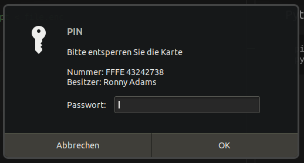

# Linux Version

## Python

Install gpg module

```bash
pip3 install python-gnupg
```

Run code

```bash
python DemoApplication_Linux.py

['Ronny Adams <         >'] ['138AF6465CE1EA53F634DA7F71C65BB4BDC009B2']
-----BEGIN PGP MESSAGE-----

hQEMA1U9vJL0xsSlAQf/cq7xvJP58+euisq3fDoGQA8EyapjoIUNoRl/DnI9wrb3
duuS0fkQ+JCTdeU9i8lJh+PqmUJJCK1jn+13MPM7z41iT5IKUHcIrb7HFssLHrAN
SSD/EiFYh1kMRom4fwKtqZlrX6yMZrmrqt/NyxsnYKqioRq8mtKMECHk3kig6Cp4
D5YyVR3YAmRZ53gqRddTfZR7AaUijpfIOb9sJfM9nf4gY1oy5YYlF3ONKaYGJk3N
AV2nXQWndkR1p8UMaYTD6f9TE/3gAf4VlEJRqt1aN9DzDX+UJIudu0XZXI1qta39
u2KsfRMoJvcEMMnOW7bvxZmIaMeOrBgyzXbKLSzax9JKAeicSnCLB3ZJMmX6H5Q4
V9qFnpJURNTQrIb7X2yPXKEmkMtyHhKvytEglbrQdFs7JHQsI+jT26660CrBAO2L
6rmXzoaxwSwIork=
=jJBa
-----END PGP MESSAGE-----
```

Enter PIN



Result

```bash
decryption ok

Das ist geheim.
```
